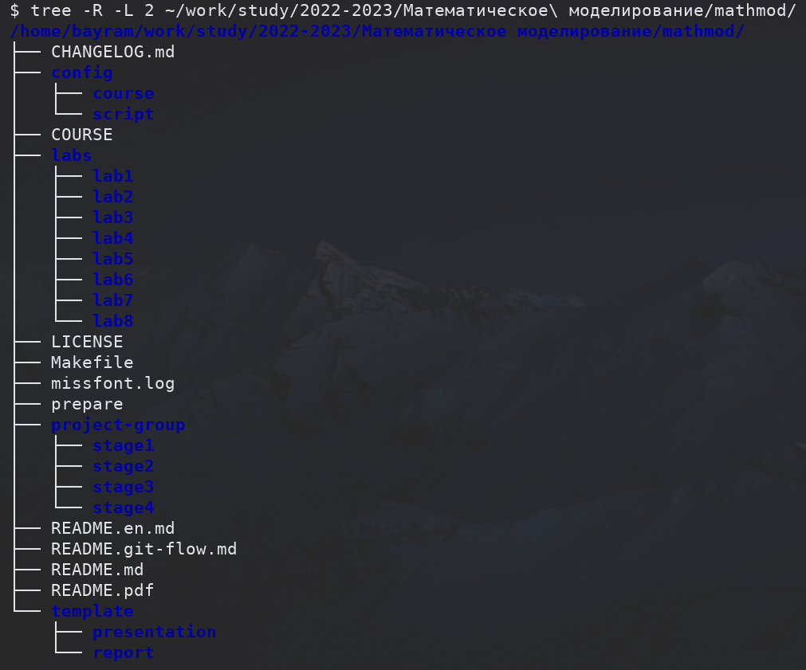

---
## Front matter
title: "Лабораторная работа 1"
##subtitle: "Простейший вариант"
author: "Тагиев Байрам Алтай оглы"

## Generic otions
lang: ru-RU
toc-title: "Содержание"

## Bibliography
##bibliography: bib/cite.bib
##csl: pandoc/csl/gost-r-7-0-5-2008-numeric.csl

## Pdf output format
toc: true # Table of contents
toc-depth: 2
lof: true # List of figures
lot: true # List of tables
fontsize: 12pt
linestretch: 1.5
papersize: a4
documentclass: scrreprt
## I18n polyglossia
polyglossia-lang:
  name: russian
  options:
	- spelling=modern
	- babelshorthands=true
polyglossia-otherlangs:
  name: english
## I18n babel
babel-lang: russian
babel-otherlangs: english
## Fonts
mainfont: DejaVu Serif
romanfont: DejaVu Serif
sansfont: DejaVu Sans
monofont: DejaVu Sans Mono
mainfontoptions: Ligatures=TeX
romanfontoptions: Ligatures=TeX
sansfontoptions: Ligatures=TeX,Scale=MatchLowercase
monofontoptions: Scale=MatchLowercase,Scale=0.9
## Biblatex
##biblatex: true
##biblio-style: "gost-numeric"
##biblatexoptions:
##  - parentracker=true
##  - backend=biber
##  - hyperref=auto
##  - language=auto
##  - autolang=other*
##  - citestyle=gost-numeric
## Pandoc-crossref LaTeX customization
figureTitle: "Рис."
tableTitle: "Таблица"
listingTitle: "Листинг"
lofTitle: "Список иллюстраций"
lotTitle: "Список таблиц"
lolTitle: "Листинги"
## Misc options
indent: true
header-includes:
  - \usepackage{indentfirst}
  - \usepackage{float} # keep figures where there are in the text
  - \floatplacement{figure}{H} # keep figures where there are in the text
---

# Цель работы

Работа с рабочим пространством, работа с git-ом и markdown.

# Задание

 - Сделайте отчёт по предыдущей лабораторной работе в формате Markdown.
 - В качестве отчёта просьба предоставить отчёты в 3 форматах: pdf, docx и md (в архиве, поскольку он должен содержать скриншоты, Makefile и т.д.)

# Выполнение лабораторной работы

1. Создали репозиторий на Github, для того, чтобы сохранять там наши изменения. После создания репозитория клонируем его и создадим все файлы для нашего курса.

{ #fig:001 } 

1. Создали рабочее пространство для лабораторных работ, групповых проектов и т.д.

{ #fig:002 width=70%}

1. Запустим скрипт автоматического развертывания рабочего пространства, создания папок, лабораторных работ и отчетов. Отправим все эти изменения на Github.

{ #fig:003 width=70%}

{ #fig:004 width=70%}

1. На удаленном репозитории можно увидеть отправленные изменения

{ #fig:005 width=70%}

1. Дальше следует сделать отчет, который я прямо сейчас пишу, потому картинок не будет.

# Выводы

По мере выполнения данной работы, я вспомнил как работать с git-ом, как работать с markdown и как собирать markdown в PDF и в DOC файлы.
